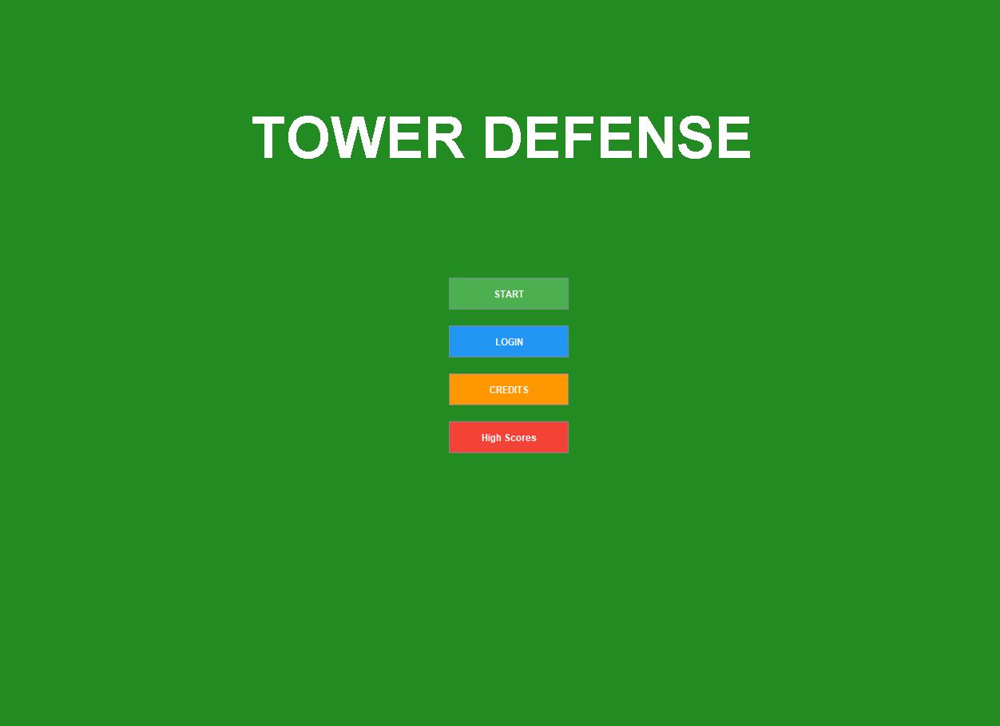
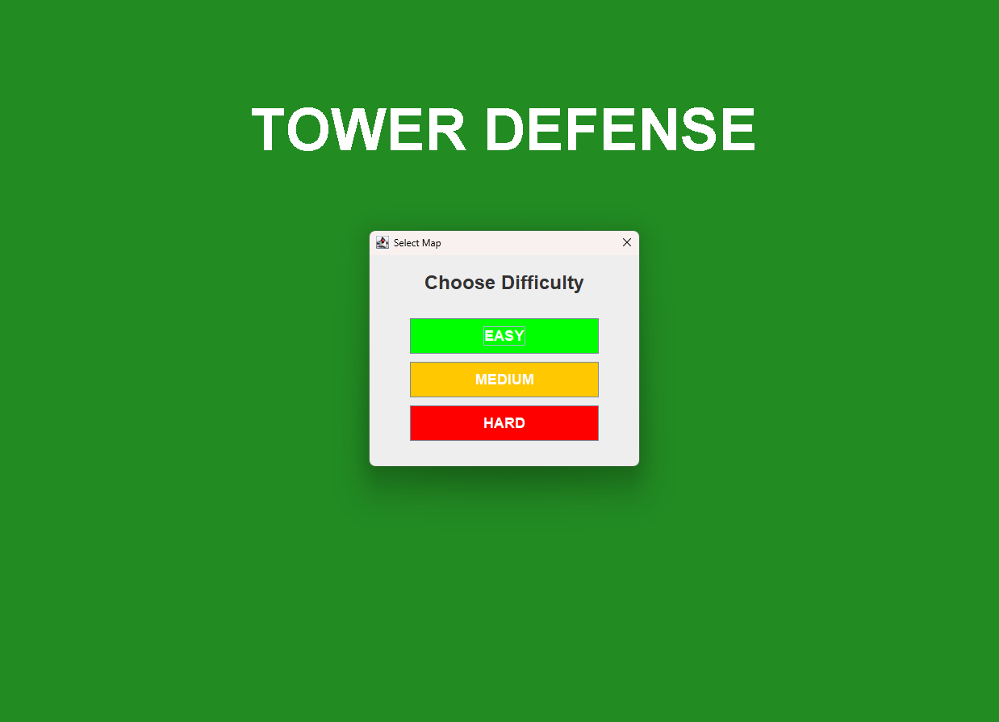
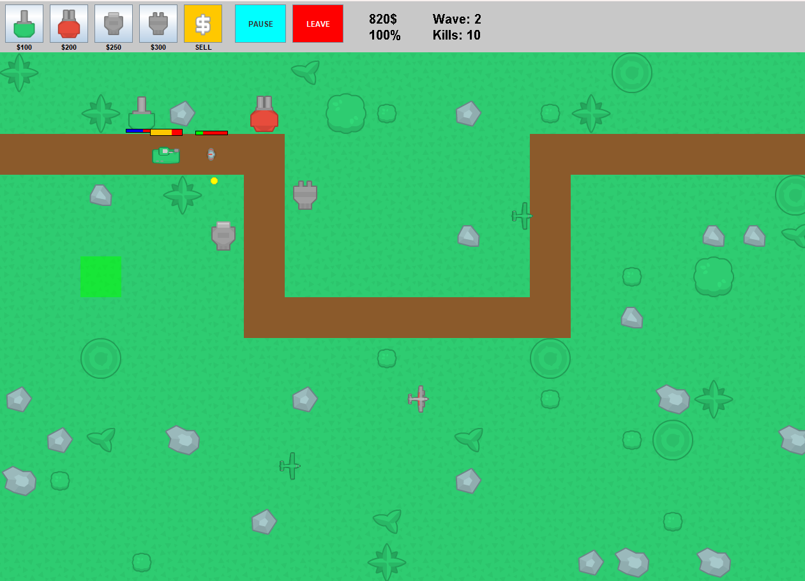

# 🏰 Tower Defense Java

A feature-rich tower defense game built with Java. Register, log in, pick your battlefield, and compete for the highest score on the leaderboard!

## 🎮 How It Works

1. **Register & Login** — Create an account or log in from the main menu
2. **Choose Your Map** — Select from 3 difficulty levels: Easy, Medium, or Hard
3. **Build & Defend** — Place towers strategically to stop incoming enemy waves
4. **Climb the Leaderboard** — Your best scores are saved and displayed on the High Score board

## ✨ Features

- **User Authentication** — Register and login system to track individual player progress
- **3 Difficulty Maps**
  - 🟢 **Easy** — More starting gold, weaker enemies — great for learning the ropes
  - 🟡 **Medium** — Balanced resources and enemy strength for a fair challenge
  - 🔴 **Hard** — Limited gold, tougher enemies — only for the brave
- **Multiple Tower Types** — 4 different towers ($100 – $300) with unique stats and abilities
- **Diverse Enemies** — Different enemy types with varying speed, health, and behavior
- **Wave System** — Survive increasingly difficult waves of enemies
- **Resource Management** — Earn and spend currency wisely to build and upgrade defenses
- **High Score Leaderboard** — Top scores displayed on the main screen — see how you rank against other players

## 📸 Screenshots

### Main Menu


### Map Selection


### Gameplay


## 🛠️ Tech Stack

- **Language:** Java
- **IDE:** NetBeans
- **Build:** Apache Ant (`build.xml`)

## 📁 Project Structure

```
TowerDefenseJava/
├── src/            # Java source code
├── assets/         # Game assets (images, sounds, etc.)
├── data/           # Game & user data (scores, accounts)
├── build/          # Compiled class files
├── nbproject/      # NetBeans project configuration
├── build.xml       # Ant build script
└── manifest.mf     # JAR manifest
```

## 🚀 Getting Started

### Prerequisites

- Java JDK 8 or higher
- NetBeans IDE (recommended)

### Run the Game

1. Clone the repository:
   ```bash
   git clone https://github.com/ErayMericDev/TowerDefenseJava.git
   ```
2. Open the project in NetBeans
3. Click **Run** ▶️
4. Register a new account and start playing!

## 📄 License

This project is open source and available for educational purposes.

## 👤 Author

**ErayMericDev** — [GitHub Profile](https://github.com/ErayMericDev)
